<!-- Project Logo -->
<div align="center">

  <!-- Logo with link -->
  <!-- Note: You might want to add a relevant logo.svg to your repo and place it in a Screenshots folder -->
  [](https://github.com/ashishkumar0724/askmydb-mysql)

  <em>Interact with your MySQL database using Natural Language</em>

  <!-- Badges -->
  [](https://github.com/ashishkumar0724/askmydb-mysql)
  [](https://github.com/ashishkumar0724/askmydb-mysql)
  [](https://github.com/ashishkumar0724/askmydb-mysql)
  
  [](https://streamlit.io/)
  [](https://www.mysql.com/)
  [](https://www.python.org/)
  [](https://ollama.com/)

</div>

---

## 🧠 Overview

**AskMyDB** is a Streamlit application that bridges the gap between natural language and database queries. It allows users to interact with their MySQL databases by simply asking questions in plain English. Leveraging the power of the DeepSeek R1 language model (hosted locally via Ollama), it translates user requests into SQL, executes them, and presents the results in an intuitive web interface.

---

## 🚀 Key Features

- 💬 **Natural Language to SQL**: Describe your data needs in English, and get SQL queries generated automatically.
- ▶️ **SQL Execution & Results**: Run generated or manually edited SQL directly and view results in a table.
- 📂 **Database Browsing**: View lists of tables and inspect their data effortlessly.
- ➕ **Data Insertion**: Easily add new records to your database tables using a simple form.
- 📤 **Result Export**: Export query results to CSV or PDF files for further analysis or sharing.
- 🛠️ **Manual SQL Editor**: Refine or write your own SQL queries before execution for precision.
- 🌐 **Integrated Workflow**: All functionalities accessible within a single, user-friendly Streamlit app.

---

## 🛠️ Built With

- [Streamlit](https://streamlit.io/) – For the interactive web application UI.
- [MySQL Connector/Python](https://dev.mysql.com/doc/connector-python/en/) – For connecting to and interacting with MySQL databases.
- [Python](https://www.python.org/) – Core programming language.
- [Ollama](https://ollama.com/) - For running the open-source DeepSeek R1 LLM locally.
- [LangChain](https://www.langchain.com/) - For interacting with the LLM and structuring prompts.

---

## 📦 Pre-requisites

- ✅ Python (3.7 or later)
- ✅ Pip (Python package manager)
- ✅ Access to a running MySQL server with a database and user credentials **or** a cloud database provider account (e.g., Supabase).
- ✅ Ollama (for local LLM interaction) **or** access to a hosted LLM API (e.g., OpenAI, Hugging Face Inference API).

## 🛠️ Pre-requisites Installation

1.  **Install Ollama (Local LLM Option):**
    *   Download and install Ollama from the [official website](https://ollama.com/).
    *   Pull the required LLM model:
        ```bash
        ollama pull deepseek-r1:1.5b
        ```
    *   *(Alternative)* For better performance with larger models, consider pulling `deepseek-r1:7b` or `llama3.1:8b` (requires more resources).

2.  **(Optional) Set up Cloud Database (e.g., Supabase):**
    *   Sign up for a free account at [Supabase](https://supabase.com/).
    *   Create a new project and database.
    *   Obtain your database connection credentials (host, database name, port, user, password).

---

## 📦 Installation

1.  **Clone the repository:**
    ```bash
    git clone https://github.com/ashishkumar0724/askmydb-mysql.git
    ```
2.  **Navigate to the project directory:**
    ```bash
    cd askmydb-mysql
    ```
3.  **(Recommended) Create a Virtual Environment:**
    ```bash
    python -m venv venv
    # Activate it:
    # On Windows:
    venv\Scripts\activate
    # On macOS/Linux:
    source venv/bin/activate
    ```
4.  **Install the dependencies:**
    ```bash
    pip install -r requirements.txt
    ```

## ⚙️ Configuration

Before running the application, you need to configure the database connection and LLM settings.

1.  Open the `config.py` file in the project directory.
2.  Update the `DB_CONFIG` dictionary with your MySQL database details:
    ```python
    # Example configuration in config.py for local MySQL
    DB_CONFIG = {
        "host": "localhost",        # Your MySQL host (e.g., "127.0.0.1")
        "database": "your_db_name", # Your MySQL database name
        "port": 3306,               # Your MySQL port (usually 3306)
        "user": "your_username",    # Your MySQL username
        "password": "your_password" # Your MySQL password
    }

    # Example configuration for Supabase
    # DB_CONFIG = {
    #     "host": "db.<your-project-ref>.supabase.co", # Your Supabase DB host
    #     "database": "postgres",                      # Usually 'postgres' for Supabase
    #     "port": 5432,                                # Supabase DB port
    #     "user": "postgres.<your-username>",          # Your Supabase user
    #     "password": "your-supabase-db-password"      # Your Supabase DB password
    # }
    ```
    *(Consider using environment variables for sensitive information like passwords in production.)*

3.  (Optional) If you plan to use a hosted LLM API instead of Ollama, you will need to modify the `llm.py` file to integrate with that service (e.g., using `langchain_openai`).

## ▶️ Running the Application

1.  **Navigate to the Project Directory:**
    Make sure you are in the `askmydb-mysql` folder and your virtual environment is activated (if used).

2.  **Start the Streamlit App:**
    Run the following command:
    ```bash
    streamlit run app.py
    ```
3.  **Access the App:**
    Your default web browser should automatically open the app, typically at `http://localhost:8501`.

## Usage:

1.  **Generate & Run Query (Tab 1):**
    *   Type your question about the database in the text area (e.g., "Show me all users from the customers table").
    *   Click "🧠 Generate SQL". The app will attempt to create the SQL query.
    *   Review the generated SQL in the editor below. You can edit it if needed.
    *   Click "▶️ Execute Edited SQL" to run the query.
    *   View the results in the table below.
    *   Use "🔁 Retry (Better Prompt)" if the initial SQL generation wasn't satisfactory.

2.  **View Database (Tab 2):**
    *   Select a table from the dropdown.
    *   Browse the data contained within that table.

3.  **Insert Data (Tab 3):**
    *   Select the table you want to add data to.
    *   Fill in the input fields for each column.
    *   Click "Insert Record" to add the new row to the database.

4.  **Export Results:**
    *   After running a query that returns data, download buttons for CSV and PDF will appear in the sidebar.
    *   Click the desired button to download the results.

5.  **Clear Session:**
    *   Use the "Clear Session" button in the sidebar to reset the application state (e.g., clear generated SQL or previous results).

## Notes:

*   The accuracy of SQL generation depends on the LLM and how well your schema represents your data.
*   Always review generated SQL before executing, especially for `UPDATE` or `DELETE` operations.
*   Error messages from the database or LLM will be displayed within the app.

## ⚡ Performance Enhancement Tips

To improve the speed and efficiency of your AskMyDB application, consider the following:

*   **Use a Cloud Database Provider:**
    *   **Supabase:** Offers a managed PostgreSQL database with excellent performance, scalability, and built-in features. Switching from a local MySQL instance to Supabase (or similar providers like PlanetScale, Neon, etc.) can significantly improve query execution speed and reliability, especially for larger datasets or remote access. Update `config.py` accordingly.
    *   **Optimize Queries:** Ensure your database tables have appropriate indexes on columns frequently used in `WHERE`, `JOIN`, and `ORDER BY` clauses. This is crucial for fast data retrieval.

*   **LLM Performance:**
    *   **Ollama Model Choice:** The `deepseek-r1:1.5b` model is fast but less capable. For better accuracy (at the cost of speed), consider using `deepseek-r1:7b` or `llama3.1:8b` if you have sufficient RAM/CPU/GPU.
    *   **Hosted LLM APIs:** Services like OpenAI GPT, Anthropic Claude, or Hugging Face Inference API often provide faster and more powerful models than running locally. Modify `llm.py` to use these APIs for potentially better SQL generation speed and quality.
    *   **Prompt Engineering:** The current prompts are basic. Refining them to provide more context or examples to the LLM can sometimes lead to faster and more accurate SQL generation.

*   **Application-Level Optimizations:**
    *   **Schema Caching:** The database schema is fetched on every app run (`extract_schema()` in `app.py`). For static schemas, consider caching this schema in `st.session_state` or a file to avoid repeated database calls.
    *   **Connection Pooling:** For high-concurrency scenarios, implementing a database connection pool can reduce the overhead of creating new connections for each query. This would require modifying the `database.py` connection logic.
    *   **Asynchronous Operations:** While Streamlit is primarily synchronous, for very long-running database queries or LLM calls, exploring asynchronous patterns or background tasks might improve perceived responsiveness (though this adds complexity).
    
